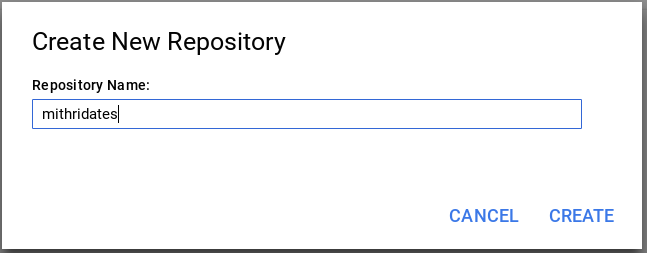
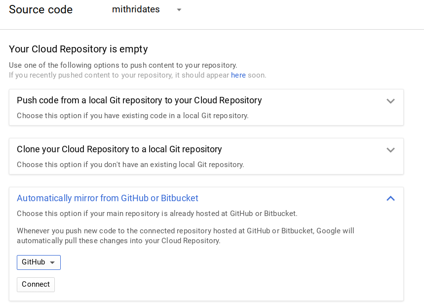
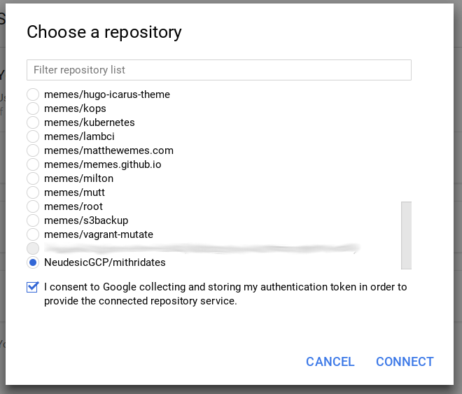

A couple of months ago I demonstrated Cloud Functions during a lunch
and learn by showing how an audio file can be uploaded to Cloud
Storage bucket and automatically transcribed to text, using Google's
Speech APIs. More recently, we worked on a project that extended this
concept to apply language translations on top of the transcribed
text. Fot the inaugral OC GCP meetup I revisited these solutions and
demonstrated how to create and deploy functions to do accomplish the
same goals. This post is a more detailed write-up of how to do this.
<!--more-->

# What are Cloud Functions?

Simply put, Cloud Functions are Google's lightweight, serverless
computing option. As a developer, you write a set of smaller Node.js
functions that react to HTTP or back-end events. The function is
expected to execute only for the lifetime of the incoming HTTP
request, or Pub/Sub event, or storage bucket event. Google's
environment takes care of routing the event to the function, and for
terminating long-running functions.

# How are they deployed?

The source for Cloud Functions can be deployed from a GCS bucket, or
from Cloud Repository. The first option is straightforward but boring,
so in this example I will be deploying from a Cloud Repository that is
linked to my GitHub account. That way I can continue my development in
public on GitHub, but still deploy from a synchronised repository in
GCP.

> **Note:** Functions deployed from a repository remain at the deployed
> version until a later version is deployed manually. Just like GCS
> deployment is point-in-time, and so changes to the repo are not
> automatically deployed. A simple CD could be built using functions
> and webhooks, for example, to work around this.

# An example: Mithridates

[Mithridates](https://en.wikipedia.org/wiki/Mithridates_VI_of_Pontus#Mithridates_as_polyglot)
was an ancient king who was said to speak all 22 languages of those he
governed. This demo application will transcribe and translate audio
files uploaded to a storage bucket. In this post I will describe
setting up the functions in a project, and then show a few lines of
code that perform the transcription.

Full source to this example can be found on
[GitHub](https://github.com/NeudesicGCP/mithridates).

## Create a new Cloud Repository and link to existing Github repository

First, we must create a new Google Cloud Repository to store the
source for our functions. Create or open an existing project in Cloud
Console and choose Source Repositories from the left-side menu, then
click **Create Repository**.

That's great, but our source is hosted in GitHub, so we must create a
mirrored repository of it. Choose to *Automatically mirror from GitHub
or Bitbucket* and click **Connect**.

Allow GCP to create an access token for your GitHub account, and then
select the source from the list. In this case I'm choosing
*mithridates* from the **NeudesicGCP** organization.

